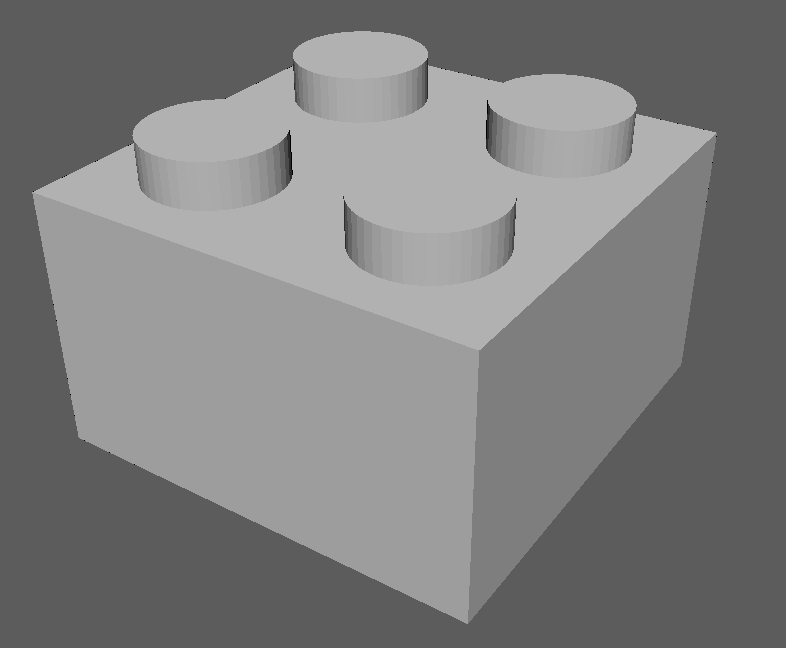

# LEGO-ifying Meshes

### Used Late Day - 10/23 4:25 pm

## Project Overview
This is a Houdini project that can "LEGO-ify" 3D models! Using procedural modeling techniques and VEX, the project converts any faceted mesh into a collection of LEGO pieces.

## Process
### Converting the Mesh to Points
The first step is to convert the mesh into a group of uniformly distributed points, where each point will eventually be converted to a LEGO brick.
- I create a bounding box surrounding the mesh and use a `pointsfromvolume` node to generate points in 3D space.
- In a separate node chain, I use a `vdbfrompolygons` and `convertvdb` node to compute the closed volume of the mesh, creating a point cloud.
- I combine the VDB volume and 3D points using a `groupcreate` node to find all points within the mesh's volume. Then, I remove all the points outside the mesh group using a `blast` node.
- Using an `attributetransfer` node, I get the color and surface normal information for each particle based on the original mesh.
    
### Converting the Points to LEGO Bricks
This project supports three overall categories of LEGO bricks, where block bricks (2x2, 2x1, 1x1) make up the body and the slope and flat bricks are layered on top of the mesh.
| Block bricks        | Slope bricks         | Flat bricks|
| -----------         | -----------          |------              |
| |  | |

To convert points into LEGO bricks, I needed to categorize the mesh points, assigning particles to different groups and placing different bricks based on the particle's group.
- The logic of the node network begins by splitting the mesh points into "top" points, for flat and slope bricks, and "body" points for the main block bricks using an `Attribute Wrangle` VEX function.

### Preventing LEGO Bricks from Intersecting
The project uses a greedy approach to place blocks, starting with placing 2x2 blocks to fill up the mesh and then filling the gaps with 2x1 and 1x1 block bricks. 

- For each brick, I perform a bounding box test. Using `Block Begin` and `Block End` nodes and for loop logic, I iterate over each particle in the mesh volume to examine each particle, placing a bounding box the size of the desired LEGO brick at its location.
    - If the number of particles within the bounding box is equal to the number of particles it would overlap if it were the first brick placed (e.g. 4 particles for a 2x2 block brick), then the current particle is a valid location at which to place a brick.
    - If the number of particles within the bounding box is less than the number it would normally overlap,
then a brick doesn't get placed (i.e. the loop continues to the next particle)

## User Controls
The project allows users to interact with the geometry by exposing certain parameters:
- Brick Scale: adjust the scale of the bricks by altering the point separation parameter.
- Slope Threshold: change the threshold at which a particle is determined to be a sloped brick instead of a block brick.
- Top Brick Coverage: adjust the percentage of flat bricks covering the surface instead of exposed bricks.
