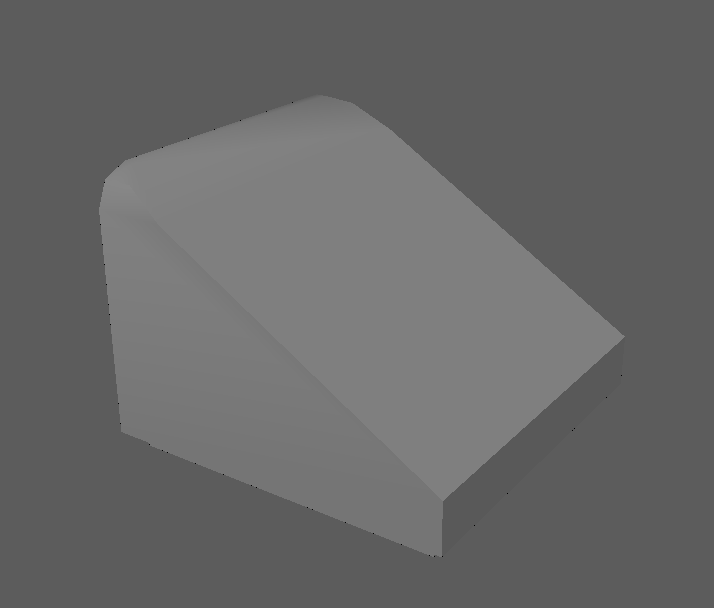

# LEGO-ifying Meshes

## Project Overview
In this assignment, you will make a Houdini project that can convert any faceted mesh to a collection of LEGO pieces.
You will continue your exploration of procedural modeling, while working with new Houdini nodes.

---

## Set up some test geometry
Use one of Houdini's Test Geometry nodes to start yourself off with a faceted mesh.
Now you have something with which to visualize the results of your nodes as you progress in your implementation.

## Converting a mesh to points
Use a VDB From Polygons node followed by a Convert VDB node to compute the closed volume of your mesh.
Then, in a separate node chain, compute the bounding box of your mesh and then use a Points from Volume node to generate points in 3D space.
Combine your VDB volume and 3D points using a Group Create node to find all of the points that fall within your mesh's volume.
Then, remove all of the points outside of that group with a Blast node.
Finally, use an Attribute Transfer node to obtain color and surface normal information for each particle based on the original mesh.

## Converting the points to LEGO bricks
For this assignment, we require you to support three overall categories of LEGO brick:
| Block bricks      | Slope bricks | Flat bricks|
| ----------- | ----------- |------|
| |        ||

In order to correctly place each type, you will need to categorize your mesh points.
- Slope bricks should be placed at any particle whose transferred surface normal is sufficiently dissimilar to the vector <0, 1, 0>.
The exact threshold of dissimiliarity is up to you to decide, as it is a matter of aesthetics.
- Flat bricks should only be placed on particles that do not have another particle above them
You can use an Attribute Wrangle node to search the immediate area of each particle using VECS code.
For example, you could find the number of points above each point using `pcfind`: `int ptsAbove[] = pcfind(0, "P", location_to_search, search_radius, 1);`
If `location_to_search` is `@P` plus some offset, you can effectively search only the area above each particle.
- Block bricks (e.g. 2x2, 2x1, and 1x1 bricks) can be placed anywhere else.

